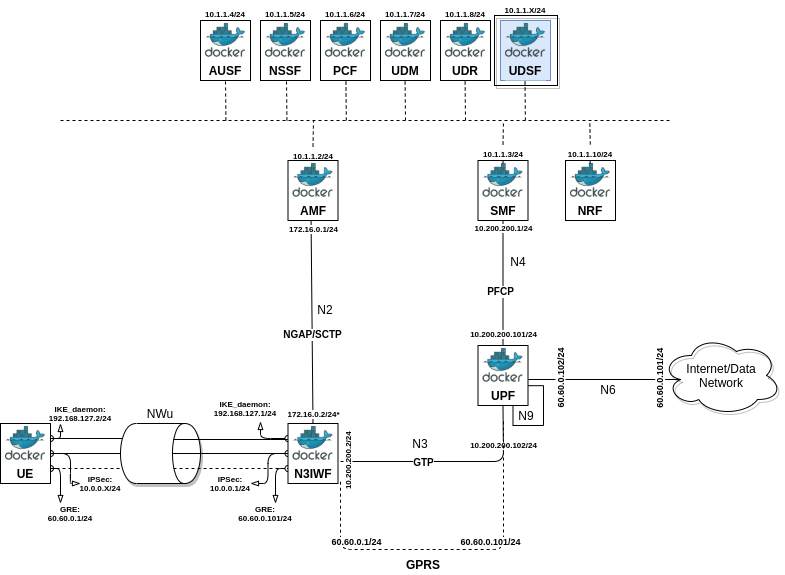

# IoTSDGw Orquestrator (IoT Software-Defined Gateway Orquestrator)

 

<!-- TODO: add here general description of the project -->
----
## Description
IoTSDGw Orchestrator is an open source implementation to provide container-based virtualization infrastructure for unreliable non 3GPP access to 5GCN between a LoRaWAN gateway and the data network at the core of the 5G network.

     

## More Infomation
* The project is composed of three implementation and execution scenarios.
   * Scenario 1 - Standard (end-to-end) LoRaWAN network, running isolated IoTSDGw Forwarder, i.e. without 5G core.
   * Scenario 2 - One-time IoTSDGw integration, between gateway and network server via non-3GPP untrusted access (full model).
   * Scenario 3 - Integration with multiple and concurrent IoTSDGws, in order to keep up with scalability.
([tutorial](docs/non3gpp-iot-use-case/non3gpp-iot-use-case.md)<!--, [video](http://youtubecom/)-->)

If you have questions or comments, please email us: [my5G team](mailto:my5G.initiative@gmail.com). 

## Documentation

For documentation, please reference to [wiki](https://github.com/my5G/IOTSDGW_ORQUESTRATOR/wiki).

## Contributing

For contribution, please reference to [guidelines](https://github.com/my5G/template/blob/main/CONTRIBUTING.md).

## License

IoTSDGw Orquestrator is now under [Apache 2.0](https://github.com/my5G/my5G-non3GPP-access/blob/master/LICENSE) license.
